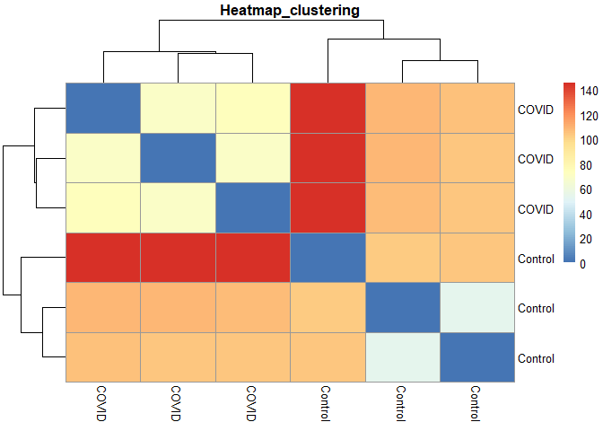

Differential Expression Analysis using DESeq2, Pathway mapping and GO
enrichment
================
Chandan Pavuluri

``` r
#Create a folder for the input files and results of the analysis
#Enter path of the folder that was created by you.
#at the end of path add "/".

path<-"C:/Users/ckpav/Documents/RNA-Seq_DEA_Pathway/DESeq2_pathway/"


#Copy the input file in to the path
#Enter input file name of the raw counts file
Input<-"GSE150392.csv"


#Total number of samples
n=6
```

# Loading required packages

``` r
if(!require('BiocManager',quietly = T)) install.packages("BiocManager");library(BiocManager)
if(!require('DESeq2',quietly = T))
  BiocManager::install("DESeq2");library(DESeq2)
if(!require('ggplot2',quietly = T)) install.packages("ggplot2");library(ggplot2)
if(!require('dplyr',quietly = T)) install.packages("dplyr");library(dplyr)
if(!require('stringr',quietly = T)) install.packages("stringr");library(stringr)
if(!require('pheatmap',quietly = T)) install.packages("pheatmap");library(pheatmap)
if(!require('EnhancedVolcano',quietly = T))
  BiocManager::install("EnhancedVolcano");library(EnhancedVolcano)
if(!require('AnnotationDbi',quietly = T))
  BiocManager::install("AnnotationDbi");library(AnnotationDbi)
if(!require('org.Hs.eg.db',quietly = T))
  BiocManager::install("org.Hs.eg.db");library(org.Hs.eg.db)
if(!require('clusterProfiler',quietly = T))
  BiocManager::install("clusterProfiler");library(clusterProfiler)
if(!require('pathview',quietly = T))
  BiocManager::install("pathview");library(pathview)
if(!require('GO.db',quietly = T))
  BiocManager::install("GO.db");library(GO.db)
if(!require('GOstats',quietly = T))
  BiocManager::install("GOstats");library(GOstats)
```

# Reading the raw counts(Counts\_matrix) and creating metadata file

``` r
# Reading the raw counts
counts_matrix <- read.table(paste0(path,Input),header=T,sep = ",")
dimnames(counts_matrix)[[1]] <- counts_matrix[,1]
counts_matrix <- counts_matrix[,-1]
dim(counts_matrix)
```

    ## [1] 36941     6

``` r
# Creating a metadata file 
meta_data<-data.frame(colnames(counts_matrix))
colnames(meta_data)[1] <- "Samples"

meta_data <- meta_data %>%
  mutate(Condition = if_else(str_detect(meta_data$Samples,"\\Cov"),"COVID","Control"))

Condition <- factor(meta_data[,2])
```

# Creating DESeqDataSet object from counts\_matrix

``` r
#Creating a DESeq Dataset object
dds <- DESeqDataSetFromMatrix(countData = counts_matrix, colData = meta_data, design = ~Condition)

#Filtering the Dataset object based on chosen Rowsum filter
dds <- dds[rowSums(counts(dds)) >= 10,]
dim(dds)
```

    ## [1] 28941     6

``` r
#Differential expression analysis
dds <- DESeq(dds)
```

# Calculating Library sizes

``` r
# visualization one row two columns 
par(mfrow=c(1,2))

# barplot for library sizes on raw counts
barplot(colSums(counts_matrix), main = "Before Normalization", las =2, cex.names = 0.75)

# Barplot for library sizes on Normalized counts
dds_norm <- counts(dds, normalized=T)
barplot(colSums(dds_norm), main = "After Normalization", las=2, cex.names=0.75)
```

<!-- -->

# PCA plot

``` r
#Number of samples
n=6
if (n<50){
rld <- rlog(dds, blind = T)
#png(paste0(path,"PCA_DESeq2",Input,".png"), 700, 500, pointsize=20)
pca <- plotPCA(rld, intgroup="Condition")+ ggtitle("PCA Plot of samples")
print(pca)
#dev.off()

}else{
vsd <- varianceStabilizingTransformation(dds, blind=T)
#png(paste0(path,"PCA_DESeq2",Input,".png"), 700, 500, pointsize=20)
pca <- plotPCA(vsd, intgroup="Condition")+ ggtitle("PCA Plot of samples")
print(pca)
#dev.off()
}
```

<!-- -->

# Boxplot for Identifying Outliers

``` r
#png(paste0(path,"Boxplot_DESeq2",Input,".png"), 700, 500, pointsize=20)
# boxplot for identifying outliers
boxplot(log10(assays(dds)[["cooks"]]), range=0, las=2) 
title("Box plot of cook's distances")
```

<!-- -->

``` r
#dev.off()
```

# Heatmap for understanding the clustering

``` r
if (n<30){
sampleDists <- dist(t(assay(rld)))
sampleDistMatrix <- as.matrix(sampleDists)
rownames(sampleDistMatrix) <- rld$Condition
colnames(sampleDistMatrix) <- rld$Condition
#png(paste0(path,"Heatmap_DESeq2",Input,".png"), 700, 500, pointsize=20)
pheatmap(sampleDistMatrix,clustering_distance_rows=sampleDists,
         clustering_distance_cols=sampleDists, main = "Heatmap_clustering")

}else{
sampleDists <- dist(t(assay(vsd)))
sampleDistMatrix <- as.matrix(sampleDists)
rownames(sampleDistMatrix) <- vsd$Labels
colnames(sampleDistMatrix) <- vsd$Condition
# png(paste0(path,"Heatmap_DESeq2",Input,".png"), 700, 500, pointsize=20)
pheatmap(sampleDistMatrix,clustering_distance_rows=sampleDists,
         clustering_distance_cols=sampleDists, main = "Heatmap_clustering")
}
```

<!-- -->

# Comparing between the groups

``` r
# Enter comparison
# If Control vs COVID --c("Condition","Control","COVID")
# If COVID vs Control --c("Condition","COVID","Control")
compare<-c("Condition","COVID","Control")

# Extract results from a DESeq analysis
res <- results(dds,compare)

head(res)
```

    ## log2 fold change (MLE): Condition COVID vs Control 
    ## Wald test p-value: Condition COVID vs Control 
    ## DataFrame with 6 rows and 6 columns
    ##                              baseMean log2FoldChange     lfcSE      stat
    ##                             <numeric>      <numeric> <numeric> <numeric>
    ## ENSG00000000003.15_TSPAN6   2364.2595     -0.9325238  0.283927 -3.284377
    ## ENSG00000000005.6_TNMD      1421.7657     -4.1624703  0.467955 -8.895026
    ## ENSG00000000419.12_DPM1     1675.1150     -0.4458774  0.445809 -1.000153
    ## ENSG00000000457.14_SCYL3     860.9035      1.5166261  0.387429  3.914594
    ## ENSG00000000460.17_C1orf112  242.8127     -0.0964369  0.442937 -0.217721
    ## ENSG00000000938.13_FGR         6.3513      1.6077389  1.264198  1.271746
    ##                                  pvalue        padj
    ##                               <numeric>   <numeric>
    ## ENSG00000000003.15_TSPAN6   1.02208e-03 7.05295e-03
    ## ENSG00000000005.6_TNMD      5.84057e-19 1.08100e-16
    ## ENSG00000000419.12_DPM1     3.17236e-01 5.30771e-01
    ## ENSG00000000457.14_SCYL3    9.05565e-05 9.47885e-04
    ## ENSG00000000460.17_C1orf112 8.27646e-01 9.13671e-01
    ## ENSG00000000938.13_FGR      2.03463e-01 3.93838e-01

# Visualization of results through Volcano plot

``` r
#png(paste0(path,"VolcanoPlot_DESeq2",Input,".png"), 700, 500, pointsize=20)
volcano_plot<-EnhancedVolcano(res,lab = NA,x = 'log2FoldChange',y = 'pvalue',pCutoff = (10e-2)/2,FCcutoff = 2.0,xlim = c(-10, 10),ylim = c(0, -log10(0.01e-12)))
print(volcano_plot)
```

<!-- -->

``` r
#dev.off()
```

# Visualization of results through MA plot

``` r
#png(paste0(path,"MAPlot_DESeq2",Input,".png"), 700, 500, pointsize=20)
DESeq2::plotMA(res,alpha=0.01, ylim=c(-6,6),colSig = "red3")
title("MA plot")
```

<!-- -->

``` r
#dev.off()
```

# Writing the Significantly differntially expressed results in to a CSV file

``` r
# Passing the results in to Dataframe
A<-data.frame(res)

# Passing the rownames to a new column
A$Ensembl_ID<-row.names(A)

# Removing the remaining charcters after "."
A$Ensembl_ID <- gsub("\\..*","", row.names(A))

# Removing the duplicates
A<-unique(A)

# Changing the rownames to clean EnsemblIDs
row.names(A)<- A$Ensembl_ID

# Statistical filtering of the results
B<-A%>%
  filter(abs(log2FoldChange)>1)%>%
  arrange(desc(log2FoldChange))%>%
  filter(pvalue<0.05)%>%
  filter(padj<0.01)

# Creating the regulation column
B$Regulation <- ifelse(B$log2FoldChange>0, "Up", "Down")

# Passing the required columns to Dataframe
B1<-B%>%
  select(pvalue,log2FoldChange,padj,Regulation)
head(B1)
```

    ##                       pvalue log2FoldChange         padj Regulation
    ## ENSG00000285839 2.299884e-08      21.848384 6.796045e-07         Up
    ## ENSG00000259976 5.487123e-08      21.259361 1.493849e-06         Up
    ## ENSG00000259080 2.091849e-12       9.547474 1.431088e-10         Up
    ## ENSG00000257065 4.536578e-13       9.290546 3.395465e-11         Up
    ## ENSG00000095752 1.082586e-52       8.539351 6.461954e-49         Up
    ## ENSG00000205867 1.097145e-09       8.442041 4.358643e-08         Up

``` r
dim(B1)
```

    ## [1] 3575    4

``` r
# writing the results to a csv
write.csv(B1,paste0(path,"DiffExp_DESeq2_",Input,"samples.csv"))
```

# Converting the Ensembl ID to Entrez ID

``` r
# Mapping the Ids from ensembl to entrez ID
A$entrez <- mapIds(org.Hs.eg.db,keys= row.names(A),column="ENTREZID",keytype="ENSEMBL",         multiVals="first")
```

    ## 'select()' returned 1:many mapping between keys and columns

``` r
# Extracting the upregulated genes
UP_df<-A%>%
  filter((log2FoldChange)>1)%>%
  filter(pvalue<0.05)%>%
  filter(padj<0.01)
UP_genes<-UP_df$entrez
head(UP_genes)
```

    ## [1] "57147" "8837"  "7035"  "23129" "5166"  "799"

``` r
# Extracting the down regulated genes
Down_df<-A%>%
  filter((log2FoldChange)<1)%>%
  filter(pvalue<0.05)%>%
  filter(padj<0.01)
Down_genes<-Down_df$entrez
head(Down_genes)
```

    ## [1] "7105"   "64102"  "3382"   "115703" "4706"   "51364"

# KEGG Enrichment Analysis

``` r
#KEGG Enrichment Analysis from reading kegg annotation online for upregulated
kegg_up <- enrichKEGG(gene = UP_genes,organism = 'hsa',pvalueCutoff = 0.05,pAdjustMethod = "BH")
kegg_up_pathways <- data.frame(summary(kegg_up))
head(kegg_up_pathways)
```

    ##                ID                            Description GeneRatio  BgRatio
    ## hsa04668 hsa04668                  TNF signaling pathway    46/694 112/8102
    ## hsa04060 hsa04060 Cytokine-cytokine receptor interaction    69/694 295/8102
    ## hsa04064 hsa04064           NF-kappa B signaling pathway    35/694 104/8102
    ## hsa04621 hsa04621    NOD-like receptor signaling pathway    42/694 181/8102
    ## hsa05134 hsa05134                          Legionellosis    21/694  57/8102
    ## hsa05133 hsa05133                              Pertussis    24/694  76/8102
    ##                pvalue     p.adjust       qvalue
    ## hsa04668 5.793123e-21 1.772695e-18 1.335467e-18
    ## hsa04060 2.944385e-15 4.504908e-13 3.393791e-13
    ## hsa04064 3.815472e-13 3.891782e-11 2.931889e-11
    ## hsa04621 1.291015e-09 9.876263e-08 7.440322e-08
    ## hsa05134 3.178767e-09 1.945405e-07 1.465579e-07
    ## hsa05133 8.524200e-09 4.347342e-07 3.275087e-07
    ##                                                                                                                                                                                                                                                                                                                                                                      geneID
    ## hsa04668                                                                                                                            8837/6401/330/7133/7185/7132/602/5743/1906/2920/3383/4792/4318/1326/6347/4790/6364/8809/7128/6372/3659/3553/3976/7187/3569/8737/9586/7424/5603/90993/7412/2921/2919/3600/64127/197259/3627/2353/3726/5293/3456/3725/1435/9021/4049/6352
    ## hsa04060 10344/7133/3604/84957/7132/3566/2920/3595/7042/3589/5008/1439/10673/3574/9466/10148/6354/6347/3977/3552/6364/3554/9173/8809/3953/7292/8795/8743/7852/3624/130399/6372/3553/8744/3976/9518/3597/3601/3569/90865/658/83729/94/9180/654/392255/3577/2921/2919/3600/2661/3575/3592/3627/6373/3576/3456/8793/23529/23765/282618/1435/3556/8718/4049/1270/2662/6352/9560
    ## hsa04064                                                                                                                                                                                 8837/330/7185/7132/5743/4791/2920/1540/3383/4616/4792/10673/5971/23586/4790/3554/7128/7706/3553/148022/10912/7187/7099/8737/8915/7412/2921/2919/3576/929/4615/3654/84433/4049/9560
    ## hsa04621                                                                                                                                       330/2920/4938/22861/4792/29108/8767/10135/6347/4790/24145/4940/4939/6772/2635/2633/7128/3553/148022/7187/84674/3569/10010/7099/8737/834/115362/5603/118429/2921/2919/5580/64127/3576/6773/3456/4615/3725/3665/51393/837/6352
    ## hsa05134                                                                                                                                                                                                                                                            1195/4791/2920/4792/29108/4790/57396/3553/718/3569/7099/834/2921/2919/3592/3576/3684/929/4615/3310/3304
    ## hsa05133                                                                                                                                                                                                                                              29108/4790/3552/6372/3659/3553/718/148022/3569/7099/834/3394/710/5603/715/3678/3592/3576/3684/2353/929/4615/3725/3654
    ##          Count
    ## hsa04668    46
    ## hsa04060    69
    ## hsa04064    35
    ## hsa04621    42
    ## hsa05134    21
    ## hsa05133    24

``` r
#KEGG Enrichment Analysis from reading kegg annotation online for down regulated
kegg_down <- enrichKEGG(gene = Down_genes,organism = 'hsa',pvalueCutoff = 0.05,pAdjustMethod = "BH")
kegg_down_pathways <- data.frame(summary(kegg_down))
head(kegg_down_pathways)
```

    ##                ID               Description GeneRatio  BgRatio       pvalue
    ## hsa00190 hsa00190 Oxidative phosphorylation    70/714 133/8102 2.014401e-39
    ## hsa05415 hsa05415   Diabetic cardiomyopathy    84/714 203/8102 5.111784e-37
    ## hsa05012 hsa05012         Parkinson disease    85/714 249/8102 4.026298e-30
    ## hsa04714 hsa04714             Thermogenesis    81/714 232/8102 1.698658e-29
    ## hsa05020 hsa05020             Prion disease    75/714 273/8102 4.031712e-20
    ## hsa05016 hsa05016        Huntington disease    79/714 306/8102 2.363084e-19
    ##              p.adjust       qvalue
    ## hsa00190 6.345364e-37 5.364668e-37
    ## hsa05415 8.051060e-35 6.806744e-35
    ## hsa05012 4.227613e-28 3.574222e-28
    ## hsa04714 1.337693e-27 1.130949e-27
    ## hsa05020 2.539979e-18 2.147417e-18
    ## hsa05016 1.240619e-17 1.048878e-17
    ##                                                                                                                                                                                                                                                                                                                                                                                                                                         geneID
    ## hsa00190                                                                        4706/7384/4708/513/4713/64077/4717/4728/506/374291/515/4709/4702/514/4694/1340/1350/10975/4698/4705/1349/4695/517/1329/4711/4704/4716/4726/54539/4715/498/518/522/528/7381/1339/4720/516/4731/27089/1345/4712/509/4714/10632/4723/10476/4725/521/4696/155066/7388/126328/1351/9377/4707/29796/55967/4700/51079/4697/4536/4514/6392/4539/4722/534/9551/539/4701
    ## hsa05415        4706/5164/7384/816/51660/5165/815/7419/4708/513/4713/2936/4717/4728/506/374291/515/4709/4702/514/4694/1340/1350/10975/4698/7137/4705/1349/4695/5160/948/517/183/1329/4711/5330/4704/4716/25874/142/817/4726/54539/4715/291/498/518/522/7381/1339/1376/4720/516/4731/27089/1345/4712/509/4714/4723/10476/5162/4725/4696/7388/126328/1351/9377/6517/4707/29796/55967/4700/51079/4697/5350/4536/4514/6392/4539/4722/5500/539/4701
    ## hsa05012 4706/7384/816/4129/815/5566/7419/4708/513/4713/4717/4728/506/374291/4780/515/4709/4702/3709/10376/514/4694/1340/10131/1350/10975/7979/4698/4705/1349/4695/517/1329/4711/4704/4716/6622/817/4726/54539/4715/291/498/518/522/7381/1339/4720/516/5710/808/4731/27089/1345/4712/509/4714/7846/4723/10476/4725/4696/54205/111/7388/126328/1351/9377/4707/29796/5413/55967/1812/4700/5071/51079/4697/4128/4536/4514/6392/4539/4722/539/4701
    ## hsa04714           4706/7384/5606/5566/6605/6604/4708/513/4713/55744/4717/4728/506/374291/515/8289/4709/4702/514/4694/1340/1350/10975/4698/4705/1349/4695/517/1329/4711/4704/4716/4726/54539/4715/498/518/522/137682/7381/1339/1376/4720/516/4731/27089/1345/4712/509/4714/10632/4723/10476/4725/521/4696/111/7388/126328/4878/1351/84987/788/9377/493753/4707/28958/29796/55967/4700/51079/4697/4536/4514/116228/6392/4539/4722/9551/539/4701
    ## hsa05020                                                 4706/7384/5566/7419/4708/513/4713/857/4717/4728/506/374291/515/4709/4702/3709/10376/514/4694/1340/1350/10975/7979/4698/4705/1349/4695/517/1329/4711/4704/4716/4726/54539/4715/291/498/518/522/7381/1339/4720/516/5710/4731/27089/1345/4712/509/4714/7846/4723/10476/4725/4696/54205/7388/126328/1351/9377/859/4707/29796/55967/4700/51079/4697/4536/4514/6392/3303/4539/4722/539/4701
    ## hsa05016                        4706/7384/7419/4708/513/4713/10126/5438/4717/4728/506/374291/515/4709/4702/10376/514/4694/1340/1350/10975/7979/4698/4705/1349/4695/55860/517/1329/4711/11258/5330/4704/4716/4726/54539/4715/291/498/518/522/7381/1339/4720/516/5710/4731/7802/27089/1345/4712/509/4714/7846/4723/10476/4725/4696/54205/7388/126328/1351/5441/9377/4707/29796/55967/4700/51079/4697/4536/4514/7052/6392/2878/4539/4722/539/4701
    ##          Count
    ## hsa00190    70
    ## hsa05415    84
    ## hsa05012    85
    ## hsa04714    81
    ## hsa05020    75
    ## hsa05016    79

# Visualizing the pathway of interest

``` r
# Foldchanges and gene names
foldchanges <- UP_df$log2FoldChange
names(foldchanges) <- UP_df$entrez

#Pathway visualization for Tumor necrosis factor
pathview(gene.data = foldchanges, pathway.id = "hsa04668", species = "hsa")

#Pathway visualization for Cytokine-cytokine receptor interaction 
pathview(gene.data = foldchanges, pathway.id = "hsa04060", species = "hsa")
```

# GO Biological Process Enrichment

``` r
#Parmeters for Upregulated
params_up <- new("GOHyperGParams",
     geneIds=UP_genes,
     universeGeneIds=A$entrez,
     annotation="org.Hs.eg.db",
     ontology="BP",
     pvalueCutoff=0.05,
     conditional=FALSE,
     testDirection="over")

#Parmeters for Downregulated
params_down <- new("GOHyperGParams",
     geneIds=Down_genes,
     universeGeneIds=A$entrez,
     annotation="org.Hs.eg.db",
     ontology="BP",
     pvalueCutoff=0.05,
     conditional=FALSE,
     testDirection="over")

# Hypergeometric Tests 
UP_GO<-hyperGTest(params_up)
UP_GO<-data.frame(summary(UP_GO))
head(UP_GO)
```

    ##       GOBPID       Pvalue OddsRatio  ExpCount Count Size
    ## 1 GO:0071310 2.108129e-46  2.621816 209.85855   408 2529
    ## 2 GO:0034097 8.014473e-46  3.454032  92.10873   238 1110
    ## 3 GO:0010033 2.889269e-45  2.464620 258.15340   467 3111
    ## 4 GO:0070887 4.593870e-45  2.464150 256.16186   464 3087
    ## 5 GO:0071345 4.935239e-42  3.405665  85.30430   220 1028
    ## 6 GO:0007166 3.596327e-36  2.293548 235.00174   414 2832
    ##                                      Term
    ## 1  cellular response to organic substance
    ## 2                    response to cytokine
    ## 3           response to organic substance
    ## 4  cellular response to chemical stimulus
    ## 5  cellular response to cytokine stimulus
    ## 6 cell surface receptor signaling pathway

``` r
# Hypergeometric Tests
Down_GO<-hyperGTest(params_down)
Down_GO<-data.frame(summary(Down_GO))
head(Down_GO)
```

    ##       GOBPID       Pvalue OddsRatio  ExpCount Count Size
    ## 1 GO:0006119 4.969122e-47 13.576928 13.947375    83  142
    ## 2 GO:0045333 3.692236e-36  8.068884 17.876213    83  182
    ## 3 GO:0022904 1.125390e-35 12.716392 11.000746    64  112
    ## 4 GO:0042775 2.088153e-35 15.756476  9.134548    58   93
    ## 5 GO:0042773 4.942907e-35 15.317737  9.232769    58   94
    ## 6 GO:0006091 1.997914e-32  3.799789 50.780231   144  517
    ##                                                     Term
    ## 1                              oxidative phosphorylation
    ## 2                                   cellular respiration
    ## 3                   respiratory electron transport chain
    ## 4 mitochondrial ATP synthesis coupled electron transport
    ## 5               ATP synthesis coupled electron transport
    ## 6         generation of precursor metabolites and energy
