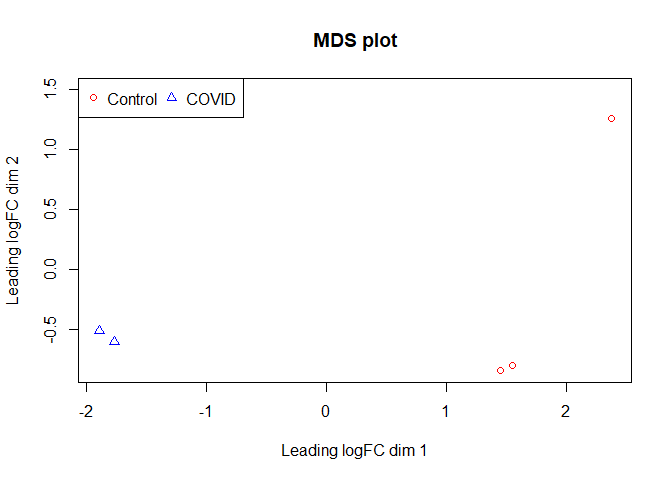
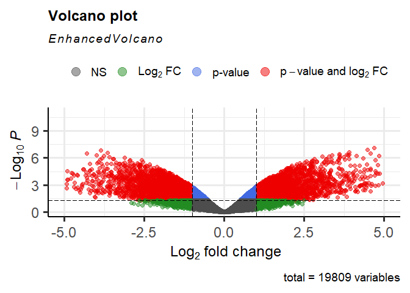
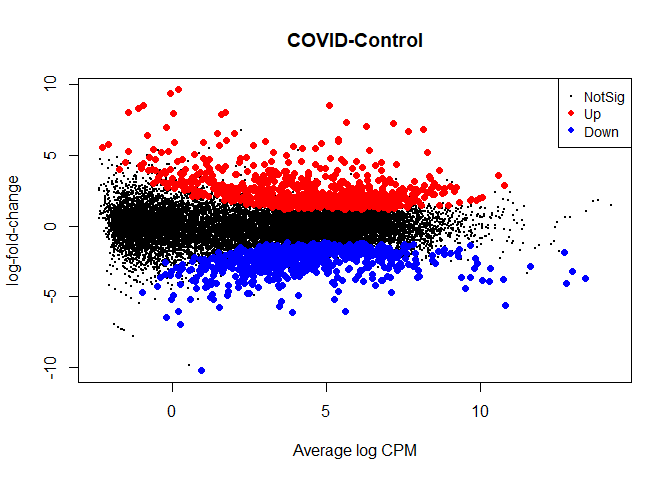

Differential Expression Analysis using edgeR
================

``` r
#Create a folder for the input files and results of the analysis
#Enter path of the folder that was created by you.
#at the end of path add "/".

path<-"C:/Users/ckpav/Documents/RNA-Seq_DEA_Pathway/edgeR/"

#Copy the input file in to the path
#Enter input file name of the raw counts file
Input<-"GSE150392.csv"
```

# Loading required packages

``` r
if(!require('BiocManager',quietly = T)) install.packages("BiocManager");library(BiocManager)
if(!require('edgeR',quietly = T))
  BiocManager::install("edgeR");library(edgeR)
if(!require('tidyverse',quietly = T)) install.packages("tidyverse");library(tidyverse)
if(!require('dplyr',quietly = T)) install.packages("dplyr");library(dplyr)
if(!require('EnhancedVolcano',quietly = T))
  BiocManager::install("EnhancedVolcano");library(EnhancedVolcano)
```

\#Reading the raw counts(Counts\_matrix) and creating metadata file

``` r
# Reading the raw counts
counts_matrix <- read.table(paste0(path,Input),header=T,sep = ",")
dimnames(counts_matrix)[[1]] <- counts_matrix[,1]
counts_matrix <- counts_matrix[,-1]
dim(counts_matrix)
```

    ## [1] 36941     6

``` r
# Creating a metadata file 
meta_data<-data.frame(colnames(counts_matrix))
colnames(meta_data)[1] <- "Samples"

meta_data <- meta_data %>%
  mutate(Condition = if_else(str_detect(meta_data$Samples,"\\Cov"),"COVID","Control"))

Condition <- factor(meta_data[,2])
```

\#Processing the counts data

``` r
#Creating object for the counts table
dge <- DGEList(counts=counts_matrix,group=meta_data[,2])

#filtering by expression
keep <- filterByExpr(dge)
dge <- dge[keep,]

dim(dge)
```

    ## [1] 19809     6

``` r
#Normalization using Trimmed mean mvalues.
dge <- calcNormFactors(dge, method="TMM")
```

# MDS plot Generation

``` r
pch <- c(1,2)
colors <- rep(c("red", "blue"),1)
#png(paste0(path,"/MDS_",Input,"_edgeR.png"), 700, 500, pointsize=20)
plotMDS(dge, col=colors[factor(meta_data[,2])], pch=pch[factor(meta_data[,2])])
legend("topleft", legend=levels(factor(meta_data[,2])),pch=pch, col=colors, ncol=2)
```

<!-- -->

``` r
#dev.off()
```

# Modelling the data

``` r
design <- model.matrix(~0+factor(meta_data[,2]))
colnames(design)[1]<-gsub(".*)", "", colnames(design)[1])
colnames(design)[2]<-gsub(".*)", "", colnames(design)[2])


#estimates the Dispersion from maximum likelihood
dge<-estimateDisp(dge, design=design, robust = T)

#Fit a quasi-likelihood negative binomial generalized log-linear model to count data 
fit <- glmQLFit(dge, design)

#Choosing the contrast
compare<-"COVID-Control"

#Constructing custom matrix
contr<-makeContrasts(compare, levels=design)

#Count genewise statistical tests
qlf<-glmQLFTest(fit, contrast=contr)

#Taking top results of the statistical test and calculating FDR
edgeR_result<-topTags(qlf, n = 100000, adjust.method = "BH")
results<-edgeR_result$table
head(qlf$table)
```

    ##                                   logFC   logCPM           F       PValue
    ## ENSG00000000003.15_TSPAN6   -0.91337148 6.017295 13.76475767 0.0051535092
    ## ENSG00000000005.6_TNMD      -4.14070016 5.280973 71.32874392 0.0000178636
    ## ENSG00000000419.12_DPM1     -0.42576774 5.522549  1.06143670 0.3307201443
    ## ENSG00000000457.14_SCYL3     1.53471522 4.565536 19.66273713 0.0017856661
    ## ENSG00000000460.17_C1orf112 -0.08015988 2.746889  0.03932792 0.8473639261
    ## ENSG00000000971.16_CFH       1.06184810 8.057230  9.49444781 0.0136717230

# Volcano plot generator

``` r
#png(paste0(path,"/Volcano_",Input,"_edgeR.png"), 700, 500, pointsize=20)
EnhancedVolcano(results,lab = NA,x = 'logFC',y = 'PValue',pCutoff = (10e-2)/2,FCcutoff = 1.0,  xlim = c(-5, 5),ylim = c(0, -log10(10e-12)))
```

<!-- -->

# MD plot Generator

``` r
#png(paste0(path,"/MD_",Input,"_edgeR.png"), 700, 500, pointsize=20)
plotMD(qlf,main=compare,p.value=0.01)
```

<!-- -->

``` r
#dev.off()
```

# Filtering the results and writing to a CSV file and generating the stats of the pipeline.

``` r
# Passing the results in to Dataframe 
A<-data.frame(results)

# Passing the rownames to a new column
A$Ensembl_ID<-row.names(A)

# Removing the remaining charcters after "."
A$Ensembl_ID <- gsub("\\..*","", row.names(A))

# Removing the duplicates
A<-unique(A)

# Changing the rownames to clean EnsemblIDs
row.names(A) <- A$Ensembl_ID

# Statistical filtering of the results
B<-A%>%
    filter(abs(logFC)>1)%>%
  arrange(desc(logFC))%>%
  filter(PValue<0.05)%>%
  filter(FDR<0.01)

# Creating the regulation column
B$Regulation <- ifelse(B$logFC>0, "Up", "Down")

# Passing the required columns to Dataframe
B1<-B%>%
  select(PValue,logFC,FDR,Regulation)
head(B1)
```

    ##                       PValue    logFC          FDR Regulation
    ## ENSG00000259080 1.044407e-04 9.612145 0.0038312335         Up
    ## ENSG00000257065 1.517459e-05 9.348977 0.0017538005         Up
    ## ENSG00000095752 8.991504e-07 8.547724 0.0006141817         Up
    ## ENSG00000205867 1.349553e-04 8.497345 0.0043468779         Up
    ## ENSG00000258052 1.125278e-04 8.330689 0.0040163305         Up
    ## ENSG00000171855 6.747588e-05 8.055380 0.0031827223         Up

``` r
# writing the results to a csv
write.csv(B1,paste0(path,"edgeR_DE_",Input,".csv"))
```

# Comparing DESeq2 and edgeR results

``` r
#DESeq2 file
Deseq2_results<-"DiffExp_DESeq2_GSE150392.csvsamples.csv"

#DEseq2 File pathway
Deseq2path<-"C:/Users/ckpav/Documents/RNA-Seq_DEA_Pathway/DESeq2_Pathway/"

#Reading the file
Deseq2<-read.table(paste0(Deseq2path,Deseq2_results),header=T,sep = ",")

#Extracting Deseq2 significantly differntially expressed genes
Deseq2<-data.frame(Deseq2[,1])
colnames(Deseq2)<-"EnsemblID"
dim(Deseq2)
```

    ## [1] 3575    1

``` r
#Extracting Deseq2 significantly differntially expressed genes
edgeR<-data.frame(row.names(B1))
colnames(edgeR)<-"EnsemblID"
dim(edgeR)
```

    ## [1] 1302    1

``` r
# Finding the common significantly differntially expressed genes
common_ID<-inner_join(Deseq2,edgeR)
dim(common_ID)
```

    ## [1] 1302    1

``` r
head(common_ID)
```

    ##         EnsemblID
    ## 1 ENSG00000259080
    ## 2 ENSG00000257065
    ## 3 ENSG00000095752
    ## 4 ENSG00000205867
    ## 5 ENSG00000226979
    ## 6 ENSG00000258052
